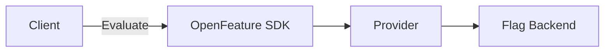

# OpenFeature Presentation Style Guide

A comprehensive guide for creating consistent, professional presentations for OpenFeature using Slidev.

## Quick Reference: Purple/Blue Gradient Theme

The OpenFeature presentation style uses a **modern purple/blue gradient aesthetic** with glowing effect that creates a cohesive, professional look across all slides.

### Core Theme Elements

```css
/* Primary Colors */
Purple: #8D8DFF, #ABABFF, #5D5DFF
Blue: #6B7DFF, #93C5FD
Light accents: #B7B9FF, #E0E0FF

/* Gradient Backgrounds */
bg-gradient-dark      /* Primary card background */
bg-gradient-purple    /* Icon badges and highlights */
bg-gradient-card      /* Secondary containers */

/* Borders */
border-purple-bright  /* #A3A3FF - Primary elements */
border-purple-light   /* rgba(141,141,255,0.35) - Secondary */
border-subtle         /* rgba(122,126,160,0.38) - Nested */

/* Glow Effects */
glow-purple          /* 0 0 25px rgba(109,118,255,0.35) */
glow-blue            /* 0 0 20px rgba(93,93,255,0.4) */
glow-purple-soft     /* 0 0 15px rgba(141,141,255,0.25) */
```

### Quick Start Example

```md
<!-- Modern card with full theme -->
<div class="card-purple glow-purple-soft" px-6 py-5>
  <div flex items-center gap-3 mb-4>
    <div class="bg-gradient-purple w-12 h-12 rounded-lg flex items-center justify-center">
      <div class="i-carbon:flag text-purple-bright text-2xl" />
    </div>
    <h3 class="text-gradient-purple text-3xl font-bold">Title</h3>
  </div>
  <p text-lg text-purple-light>Content with beautiful gradients</p>
</div>
```

## Table of Contents

- [Quick Start](#quick-start)
- [Color Palette](#color-palette)
- [Typography](#typography)
- [Layout Patterns](#layout-patterns)
- [Animation Guidelines](#animation-guidelines)
- [Component Library](#component-library)
- [Code Examples](#code-examples)
- [Best Practices](#best-practices)

## Quick Start

### Frontmatter Template

```yaml
---
theme: seriph
highlighter: shiki
css: unocss
colorSchema: dark
transition: fade-out
title: Your Presentation Title
exportFilename: your-export-name
lineNumbers: false
drawings:
  persist: false
fonts:
  sans: 'Inter'
  serif: 'Architects Daughter'
  mono: 'Fira Code'
mdc: true
preload: false
routerMode: hash
---
```

### Required Dependencies

```json
{
  "dependencies": {
    "@slidev/cli": "latest",
    "unocss": "latest",
    "@iconify-json/carbon": "latest",
    "@iconify-json/vscode-icons": "latest"
  }
}
```

## Color Palette

### Primary Colors

Use these colors for OpenFeature branding and key elements based on the [OpenFeature Branding Guidelines](https://openfeature.dev/community/branding-guidelines):

```css
/* Purple - Primary brand color with variations */
.text-purple-100 { color: #F4F4FF; }
.text-purple-200 { color: #E2E1FF; }
.text-purple-300 { color: #CBCCFF; }
.text-purple-400 { color: #ABABFF; }
.text-purple-500 { color: #8D8DFF; }
.text-purple-600 { color: #5D5DFF; }
.text-purple-700 { color: #4B4ACF; }
.text-purple-800 { color: #38379C; }
.text-purple-900 { color: #262668; }

/* Light purple text for high contrast on dark backgrounds */
.text-purple-light { color: #B7B9FF; }
.text-purple-bright { color: #E0E0FF; }

/* Blue - Secondary/accent colors */
.text-blue-400 { color: #ABABFF; }
.text-blue-500 { color: #6B7DFF; }
.text-blue-600 { color: #5D5DFF; }

/* Gradient backgrounds for depth and modern look */
.bg-gradient-purple { 
  background: linear-gradient(135deg, rgba(141, 141, 255, 0.32), rgba(183, 185, 255, 0.18));
}
.bg-gradient-dark {
  background: linear-gradient(135deg, rgba(54, 56, 85, 0.82), rgba(26, 28, 44, 0.92));
}
.bg-gradient-card {
  background: linear-gradient(135deg, rgba(54, 56, 85, 0.5), rgba(24, 26, 38, 0.45));
}

/* Glow effects for emphasis */
.glow-purple {
  box-shadow: 0 0 25px rgba(109, 118, 255, 0.35);
}
.glow-blue {
  box-shadow: 0 0 20px rgba(93, 93, 255, 0.4);
}
```

### Semantic Colors

```css
/* Success/positive - Green accents */
.text-green-400 { color: #4ADE80; }
.text-green-500 { color: #22C55E; }

/* Warning/attention - Orange/Amber */
.text-orange-500 { color: #FB923C; }
.text-amber-300 { color: #FCD34D; }

/* Error/critical - Red accents */
.text-red-500 { color: #EF4444; }
.text-red-400 { color: #F87171; }

/* Context switch warning (salmon/coral) */
.text-context-warning { color: #FA8072; }
.bg-context-warning { background: rgba(250, 128, 114, 1); }

/* Summary/info (golden yellow) */
.text-summary-color { color: #FAD16E; }
.bg-summary-color { background: rgba(250, 209, 110, 1); }

/* Neutral grays (from uno.config.ts) */
.text-gray-100 { color: #EBF1F5; }
.text-gray-200 { color: #D9E3EA; }
.text-gray-300 { color: #C5D2DC; }
.text-gray-400 { color: #9BA9B4; }
.text-gray-500 { color: #707D86; }
.text-gray-600 { color: #55595F; }
.text-gray-700 { color: #33363A; }
.text-gray-800 { color: #25282C; }
.text-gray-900 { color: #151719; }
```

### Border Colors

```css
/* Purple borders for OpenFeature brand elements */
.border-purple-light { border-color: rgba(141, 141, 255, 0.35); }
.border-purple-medium { border-color: rgba(139, 140, 215, 0.28); }
.border-purple-bright { border-color: #A3A3FF; }

/* Subtle borders for cards and containers */
.border-subtle { border-color: rgba(122, 126, 160, 0.38); }
```

### Usage Examples

```md
<!-- Highlight OpenFeature brand -->
<span text-purple-500>OpenFeature</span>

<!-- Show success states -->
<div text-green-400>✓ Evaluation successful</div>

<!-- Indicate warnings -->
<div text-orange-500>⚠ Configuration required</div>
```

## Typography

### Headings

```md
# Main Title (text-6xl, font-bold)
## Section Header (text-5xl)
### Subsection (text-4xl)
```

### Body Text Sizes

```css
.text-xl    /* 1.25rem - Large body text */
.text-2xl   /* 1.5rem - Emphasis text */
.text-3xl   /* 2rem - Small headings */
```

### Font Families

```css
font-sans    /* Inter - Default sans-serif */
font-serif   /* Architects Daughter - Handwritten style for notes */
font-mono    /* Fira Code - Code blocks */
```

### Text Styling Patterns

```md
<!-- Emphasized technical terms -->
<span text-cyan-400>feature flags</span>

<!-- Muted secondary information -->
<span opacity-70>Additional context</span>

<!-- Code-like inline text -->
<code>evaluationContext</code>

<!-- Handwritten emphasis -->
<span class="font-serif">"What Changed"</span>
```

## Layout Patterns

### Center Layout

For title slides and single-concept slides:

```md
---
layout: center
class: text-center
---

# Your Title

Subtitle or tagline
```

### Intro Layout

For speaker introductions and profiles:

```md
---
layout: intro
class: px-35
---

<div flex>
  <div
    w-120 h-120 rounded-full bg-cover bg-center
    style="background-image: url('/speaker.png');"
  />
  <div flex flex-col justify-center pl-10>
    <h1>Speaker Name</h1>
    <p>Title & Company</p>
  </div>
</div>
```

### Two-Column Layout

For comparisons and before/after scenarios:

```md
---
layout: two-cols
---

# Left Column

Content here

::right::

# Right Column

Content here
```

### Custom Grid Layouts

```md
<div grid grid-cols-2 gap-6>
  <div>Column 1</div>
  <div>Column 2</div>
</div>

<div grid grid-cols-3 gap-4>
  <div>Column 1</div>
  <div>Column 2</div>
  <div>Column 3</div>
</div>
```

### Section Divider

```md
---
layout: section
---

# New Section Title
```

## Animation Guidelines

### Progressive Disclosure with v-click

```md
<v-clicks>

- First point appears
- Second point appears
- Third point appears

</v-clicks>
```

### Synchronized Reveals

```md
<div v-click>First element</div>
<div v-after>Appears with first</div>
<div v-after>Also appears with first</div>
```

### Absolute Positioning

```md
<div v-click="3">Appears on third click</div>
<div v-click="1">Appears on first click</div>
<div v-click="2">Appears on second click</div>
```

### Transitions with Motion

```md
<div
  v-motion
  :initial="{ x: -80, opacity: 0 }"
  :enter="{ x: 0, opacity: 1, transition: { duration: 500 } }"
>
  Animated content
</div>
```

### Click-Controlled State Changes

```md
<div
  :class="$clicks < 2 ? 'opacity-0 scale-90' : 'opacity-100 scale-100'"
  transition duration-500
>
  Content that fades in and scales
</div>
```

### Visual Markup

Use `v-mark` for emphasis:

```md
<span v-mark="{ type: 'circle' }">circled text</span>
<span v-mark="{ type: 'crossed-off', color: 'red' }">crossed out</span>
<span v-mark="{ type: 'underline', color: 'green' }">underlined</span>
```

## Component Library

### Modern Card Component

Use gradient backgrounds and subtle borders for a polished, modern look:

```md
<div 
  border="1.5 solid purple-light" 
  rounded-xl 
  overflow-hidden 
  class="bg-gradient-dark"
  style="box-shadow: 0 8px 32px 0 rgba(60,66,110,0.38), 0 0 0 2px rgba(141,141,255,0.08);"
>
  <div 
    flex items-center 
    px-4 py-3
    style="background: linear-gradient(135deg, rgba(141,141,255,0.32), rgba(183,185,255,0.18));"
  >
    <div class="i-carbon:idea text-purple-bright text-xl mr-3" />
    <span font-bold text-purple-bright>Card Title</span>
  </div>
  <div px-5 py-4 text-purple-light>
    Card content goes here with beautiful gradients
  </div>
</div>
```

### Info Box (Purple/Blue Theme)

```md
<div 
  class="bg-gradient-card"
  border="1.5 solid purple-light" 
  rounded-lg 
  px-5 py-3
  style="box-shadow: 0 0 20px rgba(109, 118, 255, 0.25);"
>
  <div flex items-center gap-3>
    <div 
      class="i-carbon:information"
      text-2xl
      text-blue-400
      style="filter: drop-shadow(0 0 8px rgba(171,171,255,0.6));"
    />
    <span text-purple-light>Information with subtle glow</span>
  </div>
</div>
```

### Warning Box

```md
<div 
  bg="orange-900/30" 
  border="2 solid orange-800" 
  rounded-lg 
  px-5 py-3
  style="box-shadow: 0 0 15px rgba(251, 146, 60, 0.2);"
>
  <div flex items-center gap-3>
    <div class="i-carbon:warning text-orange-300 text-2xl" />
    <span text-orange-300>Warning message</span>
  </div>
</div>
```

### Success Box

```md
<div 
  bg="green-900/30" 
  border="2 solid green-800" 
  rounded-lg 
  px-5 py-3
  style="box-shadow: 0 0 15px rgba(34, 197, 94, 0.2);"
>
  <div flex items-center gap-3>
    <div class="i-carbon:checkmark text-green-400 text-2xl" />
    <span text-green-400>Success message</span>
  </div>
</div>
```

### Error Box

```md
<div 
  bg="red-900/30" 
  border="2 solid red-800" 
  rounded-lg 
  px-5 py-3
  style="box-shadow: 0 0 15px rgba(239, 68, 68, 0.2);"
>
  <div flex items-center gap-3>
    <div class="i-carbon:error text-red-400 text-2xl" />
    <span text-red-400>Error message</span>
  </div>
</div>
```

### Icon Badge

Use for highlighting icons with gradient backgrounds:

```md
<div
  w-12 h-12
  rounded-lg
  flex items-center justify-center
  class="bg-gradient-purple"
  style="box-shadow: 0 2px 12px rgba(141,141,255,0.12);"
>
  <div class="i-carbon:flag text-purple-bright text-2xl" />
</div>
```

### Glowing Button/Action

```md
<div
  px-6 py-3
  rounded-lg
  class="bg-gradient-purple"
  border="1.5 solid purple-bright"
  text-purple-bright
  font-bold
  cursor-pointer
  style="box-shadow: 0 0 25px rgba(109, 118, 255, 0.35); transition: all 0.3s ease;"
>
  Primary Action
</div>
```

## Code Examples

### Basic Code Block

````md
```typescript
import { OpenFeature } from '@openfeature/server-sdk';

const client = OpenFeature.getClient();
const value = await client.getBooleanValue('my-flag', false);
```
````

### With Line Highlighting

````md
```typescript {2,4-5}
import { OpenFeature } from '@openfeature/server-sdk';
import { FlagdProvider } from '@openfeature/flagd-provider';

await OpenFeature.setProvider(new FlagdProvider());
const client = OpenFeature.getClient();
```
````

### Progressive Highlighting

````md
```typescript {all|1|3-4|6}
import { OpenFeature } from '@openfeature/server-sdk';

const context = { userId: '123', tier: 'premium' };

const value = await client.getBooleanValue(
  'new-feature',
  false,
  context
);
```
````

### Code Groups with Icons

````md
::code-group

```typescript [Node.js ~i-vscode-icons:file-type-node~]
import { OpenFeature } from '@openfeature/server-sdk';
```

```java [Java ~i-vscode-icons:file-type-java~]
import dev.openfeature.sdk.OpenFeatureAPI;
```

```python [Python ~i-vscode-icons:file-type-python~]
from openfeature import api
```

::
````

### YAML Examples

````md
```yaml
apiVersion: core.openfeature.dev/v1beta1
kind: FeatureFlag
metadata:
  name: my-feature
spec:
  flagSpec:
    flags:
      my-flag:
        state: ENABLED
        defaultVariant: "on"
```
````

### Mermaid Diagrams

````md

````

## Best Practices

### Content Structure

1. **Start with Context**: Begin presentations with the problem statement
2. **Progressive Complexity**: Introduce concepts gradually
3. **Visual Hierarchy**: Use size, color, and spacing to guide attention
4. **Consistent Pacing**: Aim for 1-2 minutes per slide

### Design Consistency

**Purple/Blue Gradient Theme**: Use consistently across all interactive and prominent elements

```md
<!-- Good: Consistent purple/blue theme -->
<div class="bg-gradient-dark border-purple-bright rounded-xl glow-purple-soft">
  <span class="text-purple-bright">Featured Content</span>
</div>

<!-- Avoid: Mixing inconsistent color schemes -->
<div bg="cyan-900" border="pink-500">
  <span text="yellow-300">Inconsistent styling</span>
</div>
```

**Gradient Usage Guidelines**:
- Use `bg-gradient-dark` for primary card backgrounds
- Use `bg-gradient-purple` for icon badges and highlights
- Use `bg-gradient-card` for secondary/nested containers
- Apply glows (`glow-purple`, `glow-blue`) sparingly for emphasis

**Border Consistency**:
```md
<!-- Primary elements: bright purple border with glow -->
<div border="1.5 solid purple-bright" class="glow-purple">

<!-- Secondary elements: subtle purple border -->
<div border="1 solid purple-light">

<!-- Nested elements: very subtle border -->
<div class="border-subtle">
```

### Animation Timing

```md
<!-- Good: Reveals support narrative flow -->
<v-clicks>
- Problem: Manual feature management
- Solution: Standardized evaluation
- Benefit: Vendor-agnostic switching
</v-clicks>

<!-- Avoid: Too many simultaneous animations -->
```

### Color Usage

```md
<!-- Good: Consistent semantic meaning with purple theme -->
<span text-purple-bright>Primary Action</span>
<span text-green-400>Success State</span>
<span text-red-400>Error State</span>
<span text-orange-300>Warning</span>

<!-- Good: Using gradients for depth -->
<div class="bg-gradient-purple text-purple-bright">
  Highlighted content
</div>

<!-- Avoid: Random color choices that break theme -->
<span text-pink-300>Primary Action</span>
<span text-cyan-500>Random color</span>
```

### Glow Effects

Use glowing effects to draw attention to important elements:

```md
<!-- Interactive elements with hover glow -->
<div 
  class="card-purple transition-glow cursor-pointer"
  hover="glow-purple"
>
  Clickable card
</div>

<!-- Pulsing glow for live/active states -->
<div class="animate-pulse-glow">
  Active indicator
</div>

<!-- Avoid: Overusing glows (use max 2-3 per slide) -->
```

### Gradient Text

For special emphasis on headings or key terms:

```md
<h2 class="text-gradient-purple text-5xl font-bold">
  Feature Flag Driven Development
</h2>

<!-- Use sparingly - typically only for main titles -->
```

### Code Presentation

````md
<!-- Good: Show only relevant code -->
```typescript
const value = await client.getBooleanValue('flag-key', false);
```

<!-- Avoid: Overwhelming detail -->
```typescript
import { OpenFeature, Client, EvaluationContext, Provider } from '@openfeature/server-sdk';
import { FlagdProvider } from '@openfeature/flagd-provider';

const provider: Provider = new FlagdProvider({
  host: 'localhost',
  port: 8013,
  tls: false,
  // ... many more options
});

await OpenFeature.setProviderAndWait(provider);
const client: Client = OpenFeature.getClient();
// ... etc
```
````

### Accessibility

```md
<!-- Use descriptive alt text for images -->


<!-- Ensure sufficient color contrast -->
<div bg="white/10" text="white"> <!-- Good contrast -->
<div bg="white/5" text="gray-300"> <!-- Poor contrast -->
```

### Speaker Notes

```md
---
layout: center
---

# Your Slide Content

<!--
Add speaker notes here to guide your presentation.
These notes are only visible in presenter mode.
-->
```

### Spacing Utilities

```md
<!-- Vertical spacing -->
<div mt-6 />  <!-- margin-top: 1.5rem -->
<div mt-8 />  <!-- margin-top: 2rem -->
<div mt-12 /> <!-- margin-top: 3rem -->

<!-- Gap in flex/grid -->
<div flex gap-4>  <!-- gap: 1rem -->
<div grid gap-6>  <!-- gap: 1.5rem -->
```

## Common Patterns

### Modern Feature Comparison with Gradients

```md
<div grid grid-cols-2 gap-8>
  <!-- Before: Problems -->
  <div 
    border="2 solid red-800/50" 
    rounded-xl
    bg="red-900/20"
    px-6 py-5
  >
    <div flex items-center gap-3 mb-4>
      <div class="i-carbon:close-filled text-red-400 text-2xl" />
      <h3 text-2xl font-bold text-red-400>Before FFDD</h3>
    </div>
    <ul text-lg leading-relaxed space-y-2>
      <li>Manual flag coordination</li>
      <li>Context switching overhead</li>
      <li>Runtime errors from typos</li>
    </ul>
  </div>
  
  <!-- After: Solutions -->
  <div 
    class="card-purple glow-purple-soft"
    px-6 py-5
  >
    <div flex items-center gap-3 mb-4>
      <div class="bg-gradient-purple w-10 h-10 rounded-lg flex items-center justify-center">
        <div class="i-carbon:checkmark text-purple-bright text-2xl" />
      </div>
      <h3 text-2xl font-bold class="text-gradient-purple">With FFDD</h3>
    </div>
    <ul text-lg leading-relaxed space-y-2 text-purple-light>
      <li>Type-safe code generation</li>
      <li>Single source of truth</li>
      <li>Compile-time validation</li>
    </ul>
  </div>
</div>
```

```md
<div grid grid-cols-2 gap-6>
  <div border="2 solid red-800/50" rounded-lg>
    <div bg="red-800/30" px-4 py-2>❌ Without OpenFeature</div>
    <div px-4 py-3>
      - Vendor lock-in
      - Custom integrations
      - Inconsistent APIs
    </div>
  </div>
  
  <div border="2 solid green-800/50" rounded-lg>
    <div bg="green-800/30" px-4 py-2>✓ With OpenFeature</div>
    <div px-4 py-3>
      - Vendor-agnostic
      - Standard SDK
      - Consistent evaluation
    </div>
  </div>
</div>
```

### Timeline/Process Flow with Purple Theme

```md
<div flex items-center gap-6>
  <v-clicks>
    <!-- Step 1 -->
    <div class="card-purple px-5 py-4" style="min-width: 200px;">
      <div class="bg-gradient-purple w-12 h-12 rounded-lg flex items-center justify-center mb-3">
        <div class="i-carbon:edit text-purple-bright text-xl" />
      </div>
      <h4 font-bold text-purple-bright mb-2>Define Flags</h4>
      <p text-sm text-purple-light opacity-90>Create flag definitions in YAML</p>
    </div>
    
    <div class="i-carbon:arrow-right text-purple-500 text-3xl" />
    
    <!-- Step 2 -->
    <div class="card-purple px-5 py-4" style="min-width: 200px;">
      <div class="bg-gradient-purple w-12 h-12 rounded-lg flex items-center justify-center mb-3">
        <div class="i-carbon:code text-purple-bright text-xl" />
      </div>
      <h4 font-bold text-purple-bright mb-2>Generate Code</h4>
      <p text-sm text-purple-light opacity-90>Type-safe flag clients</p>
    </div>
    
    <div class="i-carbon:arrow-right text-purple-500 text-3xl" />
    
    <!-- Step 3 -->
    <div class="card-purple glow-purple px-5 py-4" style="min-width: 200px;">
      <div class="bg-gradient-purple w-12 h-12 rounded-lg flex items-center justify-center mb-3">
        <div class="i-carbon:checkmark text-purple-bright text-xl" />
      </div>
      <h4 font-bold text-purple-bright mb-2>Deploy Safely</h4>
      <p text-sm text-purple-light opacity-90>CI/CD validation</p>
    </div>
  </v-clicks>
</div>
```

```md
<div flex items-center gap-4>
  <v-clicks>
    <div flex flex-col items-center>
      <div i-carbon:user text-4xl text-blue-400 />
      <span mt-2>Developer</span>
    </div>
    <div i-carbon:arrow-right text-2xl />
    <div flex flex-col items-center>
      <div i-carbon:sdk text-4xl text-purple-400 />
      <span mt-2>SDK</span>
    </div>
    <div i-carbon:arrow-right text-2xl />
    <div flex flex-col items-center>
      <div i-carbon:cloud text-4xl text-green-400 />
      <span mt-2>Provider</span>
    </div>
  </v-clicks>
</div>
```

### Key Takeaway with Purple Glow

```md
<div v-click mt-12 flex justify-center>
  <div
    class="card-purple glow-purple animate-pulse-glow"
    px-8 py-6
    style="max-width: 800px;"
  >
    <div flex items-start gap-4>
      <div class="bg-gradient-purple w-14 h-14 rounded-lg flex items-center justify-center flex-shrink-0">
        <div class="i-carbon:idea text-purple-bright text-3xl" />
      </div>
      <div>
        <h3 class="text-gradient-purple text-3xl font-bold mb-3">Key Takeaway</h3>
        <p text-xl leading-relaxed text-purple-light>
          Feature Flag Driven Development embeds flags into your SDLC, 
          enabling type-safe code generation, CI/CD validation, and 
          GitOps-driven promotion for safer deployments.
        </p>
      </div>
    </div>
  </div>
</div>
```

```md
<div v-click mt-6 flex justify-center>
  <div
    border="2 solid white/5" bg="white/5" backdrop-blur-sm
    rounded-lg px-6 py-3 flex items-center gap-3
  >
    <div i-carbon:idea text-yellow-300 text-2xl />
    <span text-lg>Key insight or takeaway message</span>
  </div>
</div>
```

### Speaker Profile

```md
<div flex items-center gap-6>
  
  <div>
    <h3 text-2xl font-bold>Speaker Name</h3>
    <p text-xl opacity-80>Role @ Company</p>
    <p text-lg opacity-70 mt-2>
      <span i-carbon:logo-github /> github.com/username
    </p>
  </div>
</div>
```

### Footer with Logo

```md
<div w-full absolute bottom-0 left-0 flex items-center transform="translate-x--10 translate-y--10">
  <div w-full flex items-center justify-end gap-4>
    
  </div>
</div>
```

## Developer Journey Components

The presentation uses custom Vue components to visualize developer workflows and context switching. These components follow the OpenFeature theme with purple accents and dark backgrounds.

### DeveloperJourneyFlow Component

A horizontal flow diagram showing workflow steps with progressive disclosure and context switch tracking.

**Usage:**
```vue
<DeveloperJourneyFlow :active="$clicks" />
```

**Features:**
- Grid-based layout with 4 workflow nodes (Ticket → Flag Tool → IDE → Pull Request)
- Animated connectors between nodes showing progress
- Context switch badges that appear on transitions
- Summary chip displaying total context switches
- Arrow animation for loop-back flows (using FancyArrow integration)

**Styling Pattern:**
```css
/* Custom properties for theming */
--flow-ease: cubic-bezier(0.4, 0.15, 0.25, 1);
--flow-purple-light: rgba(141, 141, 255, 0.8);
--flow-context-warning: rgba(250, 128, 114, 0.8);  /* Salmon/coral for warnings */
--flow-summary-color: rgba(250, 209, 110, 0.8);    /* Golden yellow for summary */
```

**Color Meanings:**
- **Purple gradients**: Active/visited states, primary actions
- **Salmon/Coral (#FA8072)**: Context switches (warning color)
- **Golden Yellow (#FAD16E)**: Summary information
- **Blue gradients**: Background containers

**Performance Optimizations:**
- Uses `v-show` instead of `v-if` for FancyArrow to prevent remounting
- Computed properties for stable boolean conditions
- `will-change` and `contain` CSS properties for smooth animations
- Memoized style calculations

**Example Integration:**
```md
---
layout: default
---

# Developer Workflow

<DeveloperJourneyFlow :active="$clicks" />

<v-clicks>

- Step 1: Ticket assignment
- Step 2-3: Create flag in external tool (Context switch #1)
- Step 4-5: Return to IDE to code (Context switch #2)
- Step 6-7: Pull request review
- Step 8: Return to flag tool (Context switch #3)

</v-clicks>
```

### DeveloperJourneySteps Component

A detailed step-by-step panel showing individual workflow stages with descriptions.

**Usage:**
```vue
<DeveloperJourneySteps :active="$clicks" />
```

**Features:**
- Single active panel display (not a grid)
- Smooth transitions between steps
- Icon-based step identification
- Detailed descriptions with inline code formatting
- Step counter in panel heading

**Styling Pattern:**
```css
/* Custom properties */
--steps-bg-primary: rgba(54, 56, 85, 0.4);
--steps-bg-secondary: rgba(26, 28, 44, 0.55);
--steps-border-color: rgba(141, 141, 255, 0.35);
--steps-purple-light: rgba(183, 185, 255, 0.95);
```

**Performance Optimizations:**
- Simplified computed properties (removed unused functions)
- Bounds checking in currentStep calculation
- `will-change` and `contain` for panel animations
- Optimized transition timing

**Example Integration:**
```md
---
layout: default
---

# Step-by-Step Journey

<DeveloperJourneySteps :active="$clicks" />

<!-- Steps advance automatically with clicks -->
```

### Shared Component Patterns

Both journey components share these design principles:

1. **Consistent Easing**: `cubic-bezier(0.4, 0.15, 0.25, 1)` for smooth, professional animations
2. **Purple Brand Colors**: Primary actions and active states use OpenFeature purple
3. **Warning Colors**: Context switches and pain points use salmon/coral (#FA8072)
4. **Summary Colors**: Information chips use golden yellow (#FAD16E)
5. **Dark Gradients**: Backgrounds use layered dark blues and purples with transparency
6. **Subtle Borders**: All containers use semi-transparent purple borders
7. **Performance First**: `will-change`, `contain`, and optimized computed properties

### Best Practices for Journey Components

```md
<!-- Good: Use with Slidev's $clicks for automatic progression -->
<DeveloperJourneyFlow :active="$clicks" />

<!-- Good: Combine with v-clicks for synchronized content -->
<div grid grid-cols-2 gap-6>
  <DeveloperJourneyFlow :active="$clicks" />
  <div>
    <v-clicks>
    - Detail about current step
    - Additional context
    </v-clicks>
  </div>
</div>

<!-- Avoid: Hardcoding active values (loses interactivity) -->
<DeveloperJourneyFlow :active="5" />
```

### Custom Transitions in Journey Components

The journey components use named transitions for enter/leave animations:

```css
/* Badge transition (context switches) */
.badge-enter-active,
.badge-leave-active {
  transition: opacity 0.25s ease, transform 0.25s ease;
}

.badge-enter-from,
.badge-leave-to {
  opacity: 0;
  transform: translateY(-6px);
}

/* Panel transition (step details) */
.panel-enter-active,
.panel-leave-active {
  transition: opacity 0.3s cubic-bezier(0.4, 0.15, 0.25, 1),
              transform 0.3s cubic-bezier(0.4, 0.15, 0.25, 1);
}

.panel-enter-from,
.panel-leave-to {
  opacity: 0;
  transform: translateY(8px);
}
```

## File Organization

```
presentation/
├── slides.md              # Main presentation content
├── components/            # Custom Vue components
│   ├── Counter.vue        # Demo counter component
│   ├── DeveloperJourneyFlow.vue    # Workflow flow diagram
│   └── DeveloperJourneySteps.vue   # Step-by-step journey panel
├── pages/                # Additional slide pages
│   └── imported-slides.md
├── public/               # Static assets
│   ├── images/
│   └── logos/
├── snippets/             # Reusable code examples
│   └── examples.ts
├── uno.config.ts         # UnoCSS configuration
├── style.css             # Global styles
├── global-bottom.vue     # Global bottom component
├── package.json          # Dependencies
├── STYLES.md            # This style guide
├── NARRATIVE.md         # Presentation timing and flow
└── README.md            # Presentation notes
```

## Component Documentation

### DeveloperJourneyFlow.vue

**Purpose**: Visual workflow diagram showing developer context switching

**Props**:
- `active?: number` - Current step number (typically bound to `$clicks`)

**Key Features**:
- 4 workflow nodes with icons and descriptions
- Animated progress indicators
- Context switch badges with positioning
- Summary chip showing total switches
- FancyArrow integration for loop visualization

**Performance Notes**:
- Uses stable computed `showArrow` to prevent FancyArrow remounting
- CSS `will-change` and `contain` for animation optimization
- Memoized style calculations

### DeveloperJourneySteps.vue

**Purpose**: Detailed step-by-step walkthrough with descriptions

**Props**:
- `active?: number` - Current step number (typically bound to `$clicks`)

**Key Features**:
- 8 predefined workflow steps
- Single panel display with transitions
- Icon-based step identification
- HTML content support in descriptions

**Performance Notes**:
- Simplified computed properties (removed unused helper functions)
- Bounds checking in step calculations
- Optimized transition animations

## Exporting

```bash
# Development preview
pnpm dev

# Build for production
pnpm build

# Export to PDF
pnpm export

# Export with custom name
pnpm export --output my-presentation.pdf
```

## Resources

- [Slidev Documentation](https://sli.dev)
- [OpenFeature Branding Guidelines](https://openfeature.dev/community/branding-guidelines)
- [UnoCSS Documentation](https://unocss.dev)
- [Carbon Icons](https://icon-sets.iconify.design/carbon/)

---

**Remember**: Consistency is key. Use this style guide to maintain a professional, cohesive look across all OpenFeature presentations.
